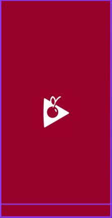
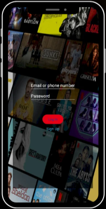
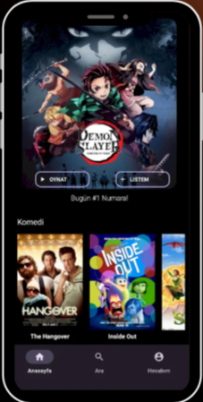
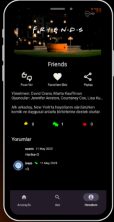
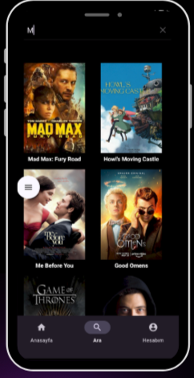
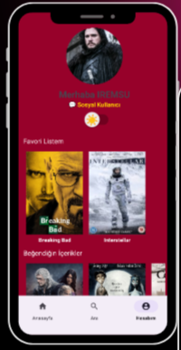

# 🍒 Cherryflix - Mobil Dizi ve Film Keşif Platformu

Cherryflix, "Ne izlesem?" sorusuna yanıt arayan kullanıcılar için tasarlanmış, popüler dizi ve filmleri keşfetmeyi sağlayan kişiselleştirilmiş bir Android uygulamasıdır. Kullanıcılar ilgi alanlarına uygun içerikleri bulabilir, favori listeleri oluşturabilir ve içerikleri puanlayarak diğer izleyicilerle etkileşime geçebilir.

## Temel Özellikler

* **Güvenli Kimlik Doğrulama:** E-posta ve şifre ile güvenli giriş/kayıt sistemi (Firebase Authentication).
* **Kişiselleştirilmiş Akış (Feed):** İçeriklerin kategori bazlı olarak yatay kaydırılabilir (RecyclerView) yapı ile sunulması.
* **Gelişmiş İçerik Detayları:** Seçilen yapımların açıklaması, posteri, YouTube Player API ile entegre fragmanı, oyuncu/yönetmen kadrosu ve kullanıcı yorumları.
* **Etkileşim:** İçeriklere puan verme, yorum yapma, favorilere ekleme ve paylaşma özellikleri.
* **Anlık Arama:** Kullanıcı yazdıkça sonuçların anlık olarak filtrelendiği hızlı arama altyapısı.
* **Hesap ve Tema Yönetimi:** Kullanıcının profil bilgilerini, favori listesini ve beğendiği içerikleri görebildiği hesap ekranı. Ayrıca Shared Preferences ile yönetilen Tema (Karanlık/Aydınlık) değiştirme özelliği.

## Kullanılan Teknolojiler ve Mimari

* **Geliştirme Ortamı:** Android Studio, Java
* **Kullanıcı Arayüzü (UI):** Fragment tabanlı ekran yapısı, ViewBinding ile arayüz yönetimi
* **Veritabanı & Backend:** Firebase Firestore (Veri yönetimi) ve Firebase Authentication (Kullanıcı girişi)
* **Medya:** Youtube Player API (Fragman oynatma)
* **Yerel Veri Saklama:** Shared Preferences (Tema değişimi ve kullanıcı tercihleri)

## Ekran Görüntüleri

*(Projenin ekran görüntülerini aşağıdan inceleyebilirsiniz)*

  
  
  

 

  
  
  

---
*Not: Bu proje eğitim ve portfolyo amacıyla geliştirilmiş olup, içerik verileri örnek amaçlıdır.*
